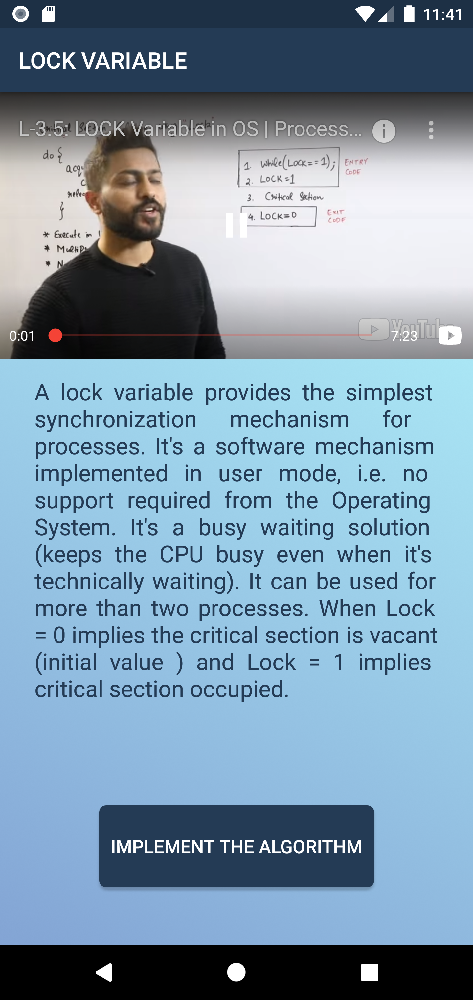
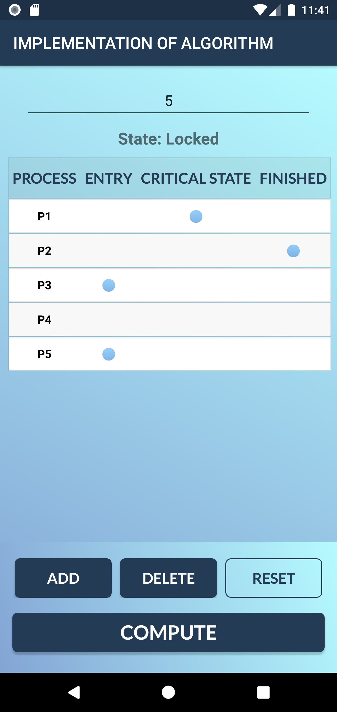
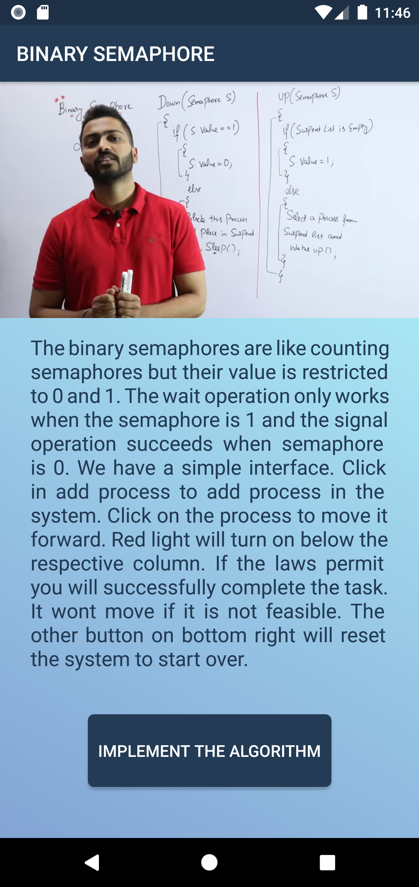
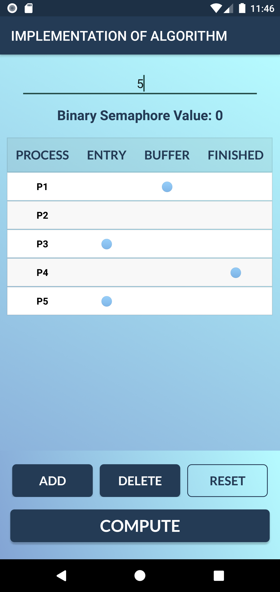
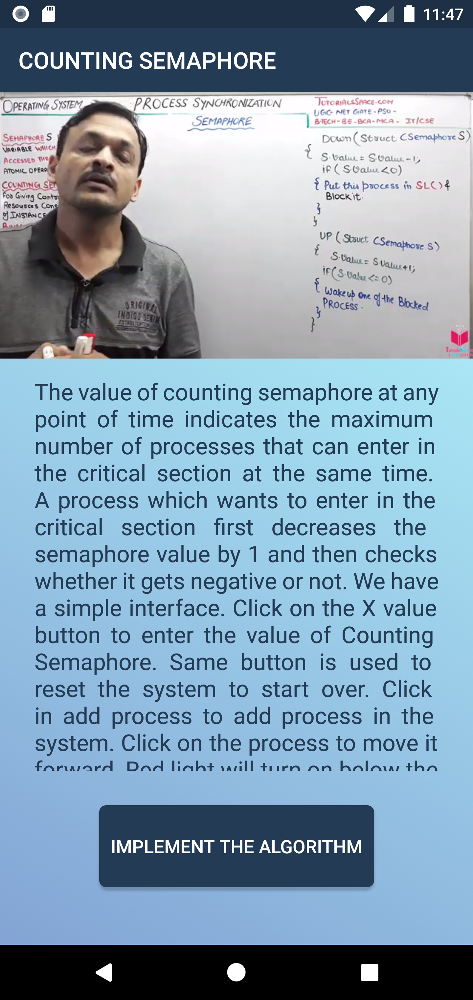
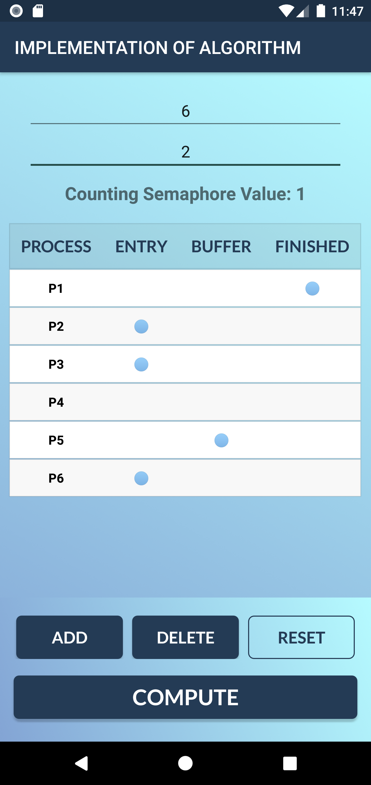

# Concurrency & Deadlock Simulator App

Operating System Course Project, Team 24.


## Authors

- Meet Sheladiya - 19BIT076
- Renish Jagani - 19BIT108
- Vivek Devre - 19BIT131
- Ananya Khandelwal - 19BIT144


## Tech Stack

**Platform:** Native Android

**IDE Used:** Android Studio

**Language:** Java (Android based), XML


## Overview

Concurrency & Deadlock Simulator App is an android application used to run and visualize Concurrency and Deadlock Algorithms, tools and methods. User here, can simulate Concurrency and Deadlock Algorithms and learn how they actually work in an Operating System.

## Installation

To install Android Studio on Windows, proceed as follows:

```bash
  1. If you downloaded an .exe file (recommended), double-click to launch it.

     If you downloaded a .zip file, unpack the ZIP, copy the android-studio folder into your Program Files folder, and then 
     open the android-studio > bin folder and launch studio64.exe (for 64-bit machines) or studio.exe (for 32-bit machines).

  2. Follow the setup wizard in Android Studio and install any SDK packages that it recommends.

That's it. The following video shows each step of the setup procedure when using the recommended .exe download.

==> https://developer.android.com/studio/videos/studio-install-windows.mp4

As new tools and other APIs become available, Android Studio tells you with a pop-up, or you can check for updates by clicking 
Help > Check for Update.
```
    
## About the App

We have Implemented Banker's Algorithm, Binary Semaphore ,Counting Semaphore,
Ostrich method and Lock variable.
<br><br>
&nbsp;&nbsp;&nbsp;&nbsp;&nbsp;&nbsp;&nbsp;&nbsp;&nbsp;&nbsp;&nbsp;&nbsp;&nbsp;&nbsp;&nbsp;&nbsp;&nbsp;&nbsp;&nbsp;&nbsp;&nbsp;&nbsp;&nbsp;&nbsp;
&nbsp;&nbsp;&nbsp;&nbsp;&nbsp;&nbsp;&nbsp;&nbsp;&nbsp;&nbsp;&nbsp;&nbsp;&nbsp;&nbsp;&nbsp;&nbsp;&nbsp;&nbsp;&nbsp;&nbsp;&nbsp;&nbsp;&nbsp;


- ### Banker's Algorithm
    
        The banker’s algorithm is a resource allocation and deadlock avoidance algorithm that tests for safety by simulating
        the allocation for predetermined maximum possible amounts of all resources, then makes an “s-state” check to test for 
        possible activities, before deciding whether allocation should be allowed to continue.

&nbsp;&nbsp;&nbsp;&nbsp;&nbsp;&nbsp;&nbsp;&nbsp;&nbsp;&nbsp;&nbsp;&nbsp;&nbsp;&nbsp;&nbsp;&nbsp;&nbsp;&nbsp;&nbsp;&nbsp;&nbsp;&nbsp;&nbsp;&nbsp;&nbsp;&nbsp;&nbsp;&nbsp;&nbsp;&nbsp;&nbsp;&nbsp;&nbsp;&nbsp;&nbsp;&nbsp;&nbsp;&nbsp;&nbsp;&nbsp;&nbsp;&nbsp;&nbsp;&nbsp;&nbsp;&nbsp;&nbsp;&nbsp;&nbsp;&nbsp;&nbsp;&nbsp;&nbsp;&nbsp;&nbsp;&nbsp;&nbsp;&nbsp;&nbsp;&nbsp;&nbsp;&nbsp;&nbsp;&nbsp;&nbsp;&nbsp;&nbsp;&nbsp;&nbsp;&nbsp;&nbsp;&nbsp;&nbsp;&nbsp;&nbsp;&nbsp;&nbsp;&nbsp;&nbsp;&nbsp;&nbsp;&nbsp;&nbsp;&nbsp;&nbsp;&nbsp;&nbsp;&nbsp;&nbsp;&nbsp;&nbsp;&nbsp;&nbsp;&nbsp;&nbsp;&nbsp;&nbsp;&nbsp;&nbsp;&nbsp;&nbsp;&nbsp;&nbsp;&nbsp;&nbsp;&nbsp;&nbsp;
- ### Lock Variable
  
        A lock variable provides the simplest synchronization mechanism for processes. Some noteworthy points regarding 
        Lock Variables are-
      
        1.	It’s a software mechanism implemented in user mode, i.e. no support required from the Operating System.
        2.	It’s a busy waiting solution (keeps the CPU busy even when its technically waiting).
        3.	It can be used for more than two processes.
        
        When Lock = 0 implies critical section is vacant (initial value ) and Lock = 1 implies critical section occupied.
&nbsp;&nbsp;&nbsp;&nbsp;&nbsp;&nbsp;&nbsp;&nbsp;&nbsp;&nbsp;&nbsp;&nbsp;&nbsp;&nbsp;&nbsp;&nbsp;&nbsp;&nbsp;&nbsp;&nbsp;&nbsp;&nbsp;&nbsp;&nbsp;&nbsp;&nbsp;&nbsp;&nbsp;&nbsp;&nbsp;&nbsp;&nbsp;&nbsp;&nbsp;&nbsp;&nbsp;&nbsp;&nbsp;&nbsp;&nbsp;&nbsp;&nbsp;&nbsp;&nbsp;&nbsp;&nbsp;&nbsp;&nbsp;&nbsp;&nbsp;&nbsp;&nbsp;&nbsp;&nbsp;&nbsp;&nbsp;&nbsp;&nbsp;&nbsp;&nbsp;&nbsp;&nbsp;&nbsp;&nbsp;&nbsp;&nbsp;&nbsp;&nbsp;&nbsp;&nbsp;&nbsp;&nbsp;&nbsp;&nbsp;&nbsp;&nbsp;&nbsp;&nbsp;&nbsp;&nbsp;&nbsp;&nbsp;&nbsp;&nbsp;&nbsp;&nbsp;&nbsp;&nbsp;&nbsp;&nbsp;&nbsp;&nbsp;&nbsp;&nbsp;&nbsp;&nbsp;&nbsp;&nbsp;&nbsp;&nbsp;&nbsp;&nbsp;&nbsp;&nbsp;&nbsp;&nbsp;&nbsp;
- ### Ostrich Method
    
        In computer science, the ostrich algorithm is a strategy of ignoring potential problems on the basis that they may be 
        exceedingly rare. It is named for the ostrich effect which is defined as "to stick one's head in the sand and pretend 
        there is no problem". It is used when it is more cost-effective to allow the problem to occur than to attempt its 
        prevention.
    
        This approach may be used in dealing with deadlocks in concurrent programming if they are believed to be very rare and 
        the cost of detection or prevention is high. For example, if each PC deadlocks once per 10 years, the one reboot may be 
        less painful than the restrictions needed to prevent it.
&nbsp;&nbsp;&nbsp;&nbsp;&nbsp;&nbsp;&nbsp;&nbsp;&nbsp;&nbsp;&nbsp;&nbsp;&nbsp;&nbsp;&nbsp;&nbsp;&nbsp;&nbsp;&nbsp;&nbsp;&nbsp;&nbsp;&nbsp;&nbsp;&nbsp;&nbsp;&nbsp;&nbsp;&nbsp;&nbsp;&nbsp;&nbsp;&nbsp;&nbsp;&nbsp;&nbsp;&nbsp;&nbsp;&nbsp;&nbsp;&nbsp;&nbsp;&nbsp;&nbsp;&nbsp;&nbsp;&nbsp;&nbsp;&nbsp;&nbsp;&nbsp;&nbsp;&nbsp;&nbsp;&nbsp;&nbsp;&nbsp;&nbsp;&nbsp;&nbsp;&nbsp;&nbsp;&nbsp;&nbsp;&nbsp;&nbsp;&nbsp;&nbsp;&nbsp;&nbsp;&nbsp;&nbsp;&nbsp;&nbsp;&nbsp;&nbsp;&nbsp;&nbsp;&nbsp;&nbsp;&nbsp;&nbsp;&nbsp;&nbsp;&nbsp;&nbsp;&nbsp;&nbsp;&nbsp;&nbsp;&nbsp;&nbsp;&nbsp;&nbsp;&nbsp;&nbsp;&nbsp;&nbsp;&nbsp;&nbsp;&nbsp;&nbsp;&nbsp;&nbsp;&nbsp;&nbsp;&nbsp;

- ### Binary Semaphore
        
        1.	A Binary Semaphore is a semaphore whose integer value range over 0 and 1.
        2.	It is nothing, but similar to a lock, with two values: 0 and 1. Here 0 means busy, while 1 means free.
        3.	The idea behind using a binary semaphore is that, it allows only one process at a time to enter the 
          	critical section (thus allowing it to access the shared resource).
        4. 	Here, 0 represents that a process or a thread is in the critical section(i.e. it is accessing the shared resource), 
          	while the other process or thread should wait for it to complete. On the other hand, 1 means that no process is 
              accessing the shared resource, and the critical section is free.
        5.	It guarantees mutual exclusion since no two processes can be in the critical section at any point in time.
        6.	Since it is just a variable, which holds an integer value, it cannot guarantee bounded waiting. It might happen,
              that a process may never get a chance to enter the critical section, which may lead to its starvation. And we
              don’t want that.
&nbsp;&nbsp;&nbsp;&nbsp;&nbsp;&nbsp;&nbsp;&nbsp;&nbsp;&nbsp;&nbsp;&nbsp;&nbsp;&nbsp;&nbsp;&nbsp;&nbsp;&nbsp;&nbsp;&nbsp;&nbsp;&nbsp;&nbsp;&nbsp;&nbsp;&nbsp;&nbsp;&nbsp;&nbsp;&nbsp;&nbsp;&nbsp;&nbsp;&nbsp;&nbsp;&nbsp;&nbsp;&nbsp;&nbsp;&nbsp;&nbsp;&nbsp;&nbsp;&nbsp;&nbsp;&nbsp;&nbsp;&nbsp;&nbsp;&nbsp;&nbsp;&nbsp;&nbsp;&nbsp;&nbsp;&nbsp;&nbsp;&nbsp;&nbsp;&nbsp;&nbsp;&nbsp;&nbsp;&nbsp;&nbsp;&nbsp;&nbsp;&nbsp;&nbsp;&nbsp;&nbsp;&nbsp;&nbsp;&nbsp;&nbsp;&nbsp;&nbsp;&nbsp;&nbsp;&nbsp;&nbsp;&nbsp;&nbsp;&nbsp;&nbsp;&nbsp;&nbsp;&nbsp;&nbsp;&nbsp;&nbsp;&nbsp;&nbsp;&nbsp;&nbsp;&nbsp;&nbsp;&nbsp;&nbsp;&nbsp;&nbsp;&nbsp;&nbsp;&nbsp;&nbsp;&nbsp;&nbsp;
- ### Counting Semaphore

        1.	A counting semaphore is a semaphore that has multiple values of the counter. The value can range over an
            	unrestricted domain.
        2.	It is a structure, which comprises a variable, known as a semaphore variable that can take more than two values 
             	and a list of task or entity, which is nothing but the process or the thread.
        3.	The value of the semaphore variable is the number of process or thread that is to be allowed inside the critical
              section.
        4.	The value of the counting semaphore can range between 0 to N, where N is the number of the number of process
              which is free to enter and exit the critical section.
        5.	As mentioned, a counting semaphore can allow multiple processes or threads to access the critical section, hence
              mutual exclusion is not guaranteed.
        6.	Since multiple instances of process can access the shared resource at any time, counting semaphore guarantees
              bounded wait. Using such a semaphore, a process which enters the critical section has to wait for the other
              process to get inside the critical section, implying that no process will starve.
&nbsp;&nbsp;&nbsp;&nbsp;&nbsp;&nbsp;&nbsp;&nbsp;&nbsp;&nbsp;&nbsp;&nbsp;&nbsp;&nbsp;&nbsp;&nbsp;&nbsp;&nbsp;&nbsp;&nbsp;&nbsp;&nbsp;&nbsp;&nbsp;&nbsp;&nbsp;&nbsp;&nbsp;&nbsp;&nbsp;&nbsp;&nbsp;&nbsp;&nbsp;&nbsp;&nbsp;&nbsp;&nbsp;&nbsp;&nbsp;&nbsp;&nbsp;&nbsp;&nbsp;&nbsp;&nbsp;&nbsp;&nbsp;&nbsp;&nbsp;&nbsp;&nbsp;&nbsp;&nbsp;&nbsp;&nbsp;&nbsp;&nbsp;&nbsp;&nbsp;&nbsp;&nbsp;&nbsp;&nbsp;&nbsp;&nbsp;&nbsp;&nbsp;&nbsp;&nbsp;&nbsp;&nbsp;&nbsp;&nbsp;&nbsp;&nbsp;&nbsp;&nbsp;&nbsp;&nbsp;&nbsp;&nbsp;&nbsp;&nbsp;&nbsp;&nbsp;&nbsp;&nbsp;&nbsp;&nbsp;&nbsp;&nbsp;&nbsp;&nbsp;&nbsp;&nbsp;&nbsp;&nbsp;&nbsp;&nbsp;&nbsp;&nbsp;&nbsp;&nbsp;&nbsp;&nbsp;&nbsp;


